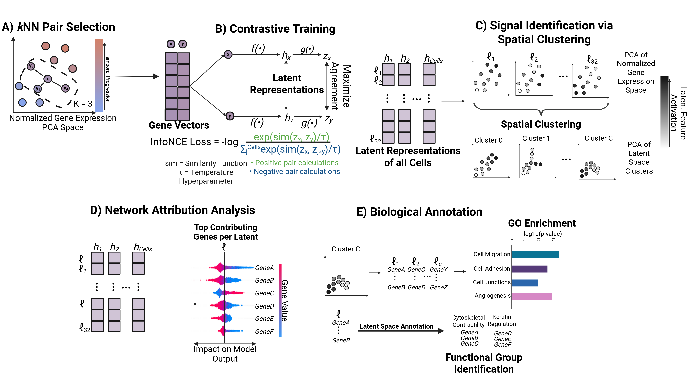

# scCont
`scCont` is an unsupervised contrastive deep learning model that extracts interpretable latent features from single-cell RNA data.

Contrastive learning is typically used to find similarities between actual and perturbed data, but we modify the typical contrastive learning framework to use the framework to learn local neighborhood functional group information in scRNA data. scCont achieves this through five steps: 1) _k_NN Pair Selection, 2) Contrastive Training, 3) Signal Identification via Spatial Clustering, 4) Network Attribution Analysis, 5) Biological Annoatation. Figure 1 visualizes these steps.



The framework operates in five stages to extract interpretable latent features (LFs) from timecourse scRNA-seq data. **A _k_-NN Pair Selection**: A _k_-Nearest Neighbor graph (K=3) is applied to the normalized gene expression space to identify positive pairs, preserving local topology. PCA is used here to reduce noise in the data. **B) Contrastive Training:** These pairs serve as inputs to a contrastive learning architecture that minimizes InfoNCE loss to maximize agreement between neighboring cells in the latent space. **C) Signal Identification via Spatial Clustering:** LF activations are projected onto the gene expression PCA space; features with correlated spatial patterns are grouped to isolate distinct signal trajectories. **D) Network Attribution Analysis:** Specific genes driving each LF are identified using feature importance scores (SHAP). **E) Biological Annotations:** LFs are connected to biological processes via a multi-tiered validation approach, combining broad Gene Ontology (GO) enrichment for clusters with functional group identification for individual top-contributing genes.

## Getting Started

### Prerequisites
To run `scCont`, clone this repository, and install the required dependencies. We highly recommend making a new python virtual environment for installing dependencies:

```bash
git clone [https://github.com/nramani611/scCont.git](https://github.com/YOUR_USERNAME/scCont.git)
cd scCont
pip install -r requirements.txt
```

This repository contains a step-by-step Jupyter Notebook tutorial designed to walk you through the five-stage pipeline and provide guidance on applying scCont to your own scRNA-seq data. To reproduce the core findings and figures from our manuscript, run the scCont pipeline Jupyter Notebook.

## Repository Structure & Data

There are 13 folders in this repository - one for each dataset banchmarked in the study. Due to GitHub file size limits, all of the `.gz` datasets are hosted externally. All full datasets used to train scCont are available via this [Google Drive link](https://drive.google.com/drive/folders/1sqRm1o5t8Tizw4sQfJXdQ-blWzii3jVh?usp=sharing).

The following files are available for all datasets:
* `.gz` file: The processed dataset used to train scCont.
* `GO_Enrichment_Results.xlsx`: GO enrichment results from each cluster (calculated post-Stage 3). Each sheet corresponds to a different spatial cluster.
* `encoder.pth`: The saved PyTorch weights of the encoder function after training.

Specific Dataset Annotations
The `MCF10A_TGFB1` folder and all `A549` dataset folders contain additional metadata used to generate manuscript figures:
* `functional_groups.json`: Dictionary mapping functional group names to the specific genes involved.
* `group_to_latent.json`: Dictionary mapping functional group names to their source latent feature index.
* `invert_shap.json`: Dictionary mapping latent features to a boolean indiciating if SHAP values were inverted to establish a positive correlation with experimental time.
* `latent_to_bifurcation.json`: Dictionary mapping latent features to a boolean indicating if it was identified as a bifurcating trajectory _(Note: This analysis is specific to the MCF10A_TGFB1 dataset)._

## Contact
If you have any questions, encounter issues, or help adapting `scCont` for your own data, please open an issue on this repository or contact the correpsonding author, Neal Kewalramani, at nramani@bu.edu.
